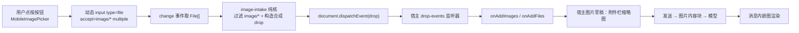

# 移动端图片上传入口（视图功能）

Feature Name: mobile-image-upload
Updated: 2026-09-16

## Description

在移动端输入框左工具行注入一个「上传图片」按钮：点按打开系统图片选择器（`accept="image/*"`，多选），选中图片经**合成 drop 事件**送入宿主 document 级收件监听器，走宿主原生图片草稿链路（缩略图预览 → 发送时转图片内容块 → 消息内嵌图渲染）。插件不接管任何 single 槽位、不替换宿主默认呈现，桌面端零影响。

## 可行性依据（对三代宿主客户端包的源码级查证）

- 0.1.1-rc.2：`conversation.input.attachments` 槽位（single）owner 提供 `onAddImages`；图片收件仅由 document 级 drop 监听器驱动（`drop-events`），无隐藏 `<input type=file>`、无可见上传按钮——移动端完全没有入口
- 0.1.2-rc.1 / 0.1.5-rc.2：同槽位改为 `onAddFiles`（0.1.5 起含通用文件与上传进度），drop 监听器仍保留
- 三代宿主的收件监听器均形如：`drop` 事件 → 校验 `dataTransfer.types` 含 `Files` → `onAddImages/onAddFiles([...dataTransfer.files])`，**不校验 isTrusted、不要求前置 dragenter**——合成 drop 事件在 document 上派发即可全代打通
- `conversation.input.left`（list，scope: session）三代宿主均存在，注入按钮无接管风险；无会话时宿主不渲染该槽位

## Architecture



## Components and Interfaces

### 1. `src/client/core/image-intake.ts` — 纯核（零 import）

```ts
export function stageImagesAsDrop(files, makeTransfer, makeDropEvent): StageImagesResult | null
// 过滤 image/*；全部非图片返回 null；构造 DataTransfer（items.add 逐个加入）
// 用工厂构造 drop 事件（先 DragEvent 构造器，失败回退 initDragEvent，均失败返回 null）
export interface StageImagesResult { images: readonly File[]; event: Event }
```

- `makeTransfer` / `makeDropEvent` 注入，单测可用假实现；浏览器侧绑定 `new DataTransfer()` 与两段构造逻辑
- 不 import 宿主包、不 import DOM（`File`/`Event` 仅作类型标注，`typeof DragEvent` 从 deps 传入）

### 2. `src/client/components/MobileImagePicker.tsx` — 槽位组件

- 注册在 `conversation.input.left`（`PropsRuntime<'conversation.input.left'>` + `PropsLocale<typeof NS>`，与 MobileNavToggle 同模式）
- 渲染 `<button data-mobile-nav="image-picker">`（图标 + `aria-label`/`title` 用 i18n 键 `uploadImage`）
- 点按：动态创建 `<input type=file accept="image/*" multiple>` 挂 body、同步 `.click()`、change 后取 `input.files`、调纯核、`document.dispatchEvent(event)`、清理 input
- 移动端可见性：组件渲染本身不做媒体查询（槽位在桌面也渲染，用 CSS 隐藏，与仓库 desktop-hide 纪律一致）

### 3. 样式

- `compat.css.ts` 移动块：按钮尺寸对齐 `_add` 命令按钮（28px 圆角），禁用态样式
- `misc.css.ts` 桌面隐藏块：`[data-mobile-nav="image-picker"]` 加入既有隐藏清单（AGENTS.md 维护约定）
- 消息内嵌图移动端约束：结构性选择器（不依赖哈希类）限 `max-width: 100%`

### 4. i18n

- `locales.ts`：zh `uploadImage: '上传图片'` / en `uploadImage: 'Upload image'`（`MobileNavKey` 自动派生）

## Data Models

无持久化数据。运行时数据流：`File[]`（浏览器 File 对象，来自 input.files）→ 纯核过滤 → `DataTransfer.items` → 宿主草稿附件（宿主内存态）。

## Correctness Properties

1. 合成 drop 必须携带 `types` 含 `'Files'` 的 DataTransfer，否则宿主监听器直接忽略（等价于空操作）
2. `event.preventDefault()` 由宿主监听器调用，插件派发时 `cancelable: true` 以保证监听器内 preventDefault 生效
3. 图片过滤以 MIME `image/*` 为准，空类型文件视为非图片（与宿主 rails 的媒体类型判定一致）
4. 多选顺序保留：同一 drop 事件一次携带全部文件，顺序与选择器返回一致
5. 插件不持有宿主槽位 state；收件拒绝（canAcceptDrop=false）时宿主自行忽略，插件无感知、无副作用
6. 动态 input 必须在 change 后从 DOM 移除，避免泄漏
7. 桌面零影响：槽位为 list 附加注入，宿主无默认 occupant 被替换；CSS 双保险隐藏

## Error Handling

| 场景 | 行为 |
| --- | --- |
| 所选文件含非图片 | 纯核过滤，仅图片进入投放 |
| 所选文件全为非图片 | 不派发事件，无提示（选择器 accept 已前置过滤） |
| DragEvent 构造器不支持 dataTransfer 参数 | 回退 `createEvent('DragEvent')` + `initDragEvent` |
| 两条构造路径均不可用 | 静默放弃，console.debug 记录（debug 徽章可捕获） |
| 宿主收件拒绝（忙碌/子代理） | 宿主静默忽略，与真实拖拽行为一致 |
| 无会话（槽位不渲染） | 按钮不存在 |

## Test Strategy

- **单元（node --test，`tests/image-intake.test.ts`）**：纯核 6-8 case——图片过滤、全非图片返回 null、items 逐个加入、事件构造参数（type/bubbles/cancelable/dataTransfer）、DragEvent 失败回退 initDragEvent、双失败返回 null
- **类型门**：`pnpm verify`（host+client 双工程）
- **CDP 回归（待真机/宿主 profile，不入 CI）**：`scripts/probes/` 扩展——按钮在场、点按后附件栏出现缩略图、发送后消息内嵌图渲染；0.1.1-rc.2 宿主跑 drop-only 路径
- **桌面零影响**：主探针断言桌面场景（pointer: fine）无 `[data-mobile-nav="image-picker"]` 可见元素

## References

[^1]: 宿主收件监听器（0.1.5 主线）：`packages/client/ui-attachment/src/client/drop-events.ts`（installDocumentDropEvents，drop 分支不校验 isTrusted）
[^2]: 槽位契约（0.1.1-rc.2 / 0.1.2-rc.1 / 0.1.5-rc.2 均存在）：`conversation.input.attachments`（single）+ `conversation.input.left`（list，scope: session），owner props 见各代 `dsh-client-ui-conversation` 的 contract/slots 类型
[^3]: 图片草稿契约：`ComposerImageAttachment { kind:'image', file, previewUrl, width?, height? }`，发送时 base64 进提示词（0.1.1-rc.2 为图片专用附件体系，「image-only send」）
[^4]: 仓库注入纪律：AGENTS.md「断点与设备」——新增注入控件必须同步进 misc.css.ts 桌面隐藏块清单
