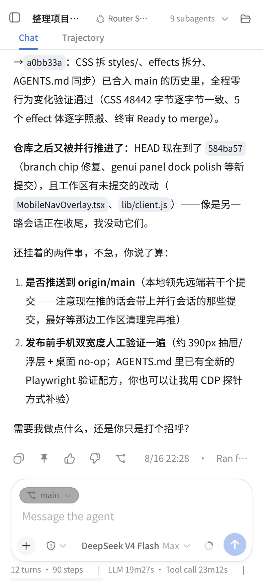
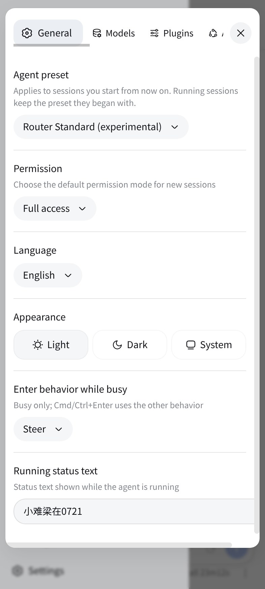

<p align="center">
  <strong>DSH Web UI 移动端适配：窄屏好用，宽屏适用</strong>
</p>

<p align="center">
  <a href="LICENSE"></a>
  <a href="https://github.com/topics/dsh-plugin"></a>
  <a href="https://awesome-dsh-plugin.com/p/multielement/dsh-web-mobile/"></a>
</p>

> 📦 **已内置于 [DSHA](https://github.com/qiannianhuanxiang/DSHA)** —— DeepSeek Harness 安卓启动器把本插件作为内置移动端适配，装 APK 开箱即用。感谢作者 [@qiannianhuanxiang](https://github.com/qiannianhuanxiang) 的集成与推广 🙏

> **项目来源声明**：本仓库由 [multielement](https://github.com/multielement) 维护，基于 [mexiaosqwq/dsh-web-mobile](https://github.com/mexiaosqwq/dsh-web-mobile)（MIT License）修改而来。在保留上游全部功能的基础上，本仓库新增的改动集中说明在「本仓库的改动」一节。

---

**dsh-web-mobile** 是 DeepSeek Harness Web UI 的移动端适配插件——让 DSH 在手机竖屏下也能好好用：

- **侧栏变抽屉**：手机竖屏下侧栏收进 overlay 抽屉，会话区全宽，点会话行自动收起；屏幕左缘右滑呼出、抽屉内右滑收起
- **弹窗变浮层**：设置、文件树、预览改成底部 sheet，触屏好点
- **状态栏避让**：刘海安全区、深/浅主题、双击缩放都处理
- **输入区不打架**：权限胶囊、模型名、切换菜单在窄屏下不重叠
- **长会话不卡流量**：宿主返回的大 JSON（会话历史等）自动 gzip/brotli 压缩，手机端加载明显提速
- **字号全局联动**：宿主的字号设置同步缩放整套移动端 UI（消息正文、抽屉、底部按钮、设置浮层等），不只是会话内容
- **缩放钉死（安卓）**：viewport 锁定 1x，捏合、双击、无障碍文本缩放都不能扭曲移动端布局（Oppo Find X8 等机型实测适配）
- **总消耗 Token**：目录抽屉底部新增全局 Token 消耗计数（所有会话累计），点按刷新
- **上传图片（视图功能）**：输入框左侧工具栏新增图片选择入口，选中的图片以缩略图进入输入区、发送后消息内联显示，多模态模型可直接识别图片里的界面
- **平板也管**：768–1023px 触屏设备限宽居中，≥1024px 触屏大平板的会话行 ⋯ 菜单仍带「删除会话」；桌面端（鼠标指针）任何宽度都是完全 no-op，窄窗口/系统缩放也不会误启移动 UI
- **诊断方便**：`?mobile-nav-debug=1` 显示悬浮诊断条（视口 / 浮层状态 / JS 错误）

---

## 效果

| 会话主页 | 目录抽屉 | 设置界面 |
| --- | --- | --- |
|  |  |  |

## 本仓库的改动

相对上游（截至其 `main` 的 `7ae9bcb`），本仓库新增四项改动（即 v2.5.0 更新内容）：

### 字号全局联动

宿主的字号设置（CSS 变量 `--dsh-content-font-size`，12–17px，默认 14px）此前只影响会话消息正文；本改动让**整套移动端 UI**（消息正文、目录抽屉、底部按钮、设置浮层、状态条、芯片等）跟随该设置同步缩放。实现方式：样式表先推导统一增量 `--dsh-web-mobile-font-delta = 宿主字号 − 14px`，全部移动端字号按该增量插值；旧宿主未发布该变量时增量为 0，字号保持原样。特例：iOS 防聚焦放大的 16px 输入框下限保持固定，不参与缩放。

### 总消耗 Token

目录抽屉底部最左新增**全局 Token 消耗计数**（输入 / 输出 / 缓存读 / 缓存写 / 推理五项合计，所有会话累计，非当前会话），点按刷新。数据由宿主半区新增的 `GET /api/mobile-nav.tokens.total` 端点折叠全部会话的 usage 记录得出，与当前会话的 token 计不同源；该 pill 仅在移动端抽屉渲染，桌面完全隐藏。

### 缩放钉死（安卓，Oppo Find X8 适配）

武装期 viewport meta 写入 `maximum-scale=1, user-scalable=no`，把捏合、双击、无障碍文本缩放全部锁死在 1x，浏览器缩放不再能扭曲移动端布局；配套 CSS 加固：`text-size-adjust: 100%` 禁用引擎字体膨胀，`overscroll-behavior-y: none` 禁用下拉刷新 / 橡皮筋回弹。iOS 10+ 忽略这两个缩放 token，其聚焦放大修复（16px 输入下限 + 捏合回路）不受影响。

### 上传图片（视图功能）

输入框左侧工具栏（`conversation.input.left` 槽）新增**图片选择按钮**（回形针图标，仅移动端显示）：点按打开系统图片选择器（多选、仅图片），选中图片经**合成 document drop 事件**送入宿主原生附件收件通道——缩略图预览、上传、消息内嵌图、模型视觉内容块全部复用宿主原生链路，插件只补移动端入口（宿主 WebUI 无可见上传按钮，触屏无法拖拽）。多模态模型即可直接识别图片中的界面（无需 ADB/无障碍）；文本模型下宿主按原生规则降级（图片省略）。桌面端按钮完全隐藏。

## 更新内容

### v2.5.5

**优化**

- 输入框权限/计划控件的收缩规则兼容 0.1.5：按槽位与类名双重匹配模式容器，旧宿主布局不变

### v2.5.4

**优化**

- DSHA 预设入口锚点恢复右侧位置并参与收缩，宽屏触控下与页首控件同排；页首弹层定位排除锚点容器

### v2.5.3

**优化**

- 适配 DSH 0.1.5 右侧面板：Files/预览在手机上全屏覆盖会话区而非压缩输入区，插件加载清单同步加入 dsh-client-ui-sidebar-right
- 侧栏入口顶部对齐页首控制行中心；输入框字号降为 13px 基准并继续跟随宿主字号联动

### v2.5.2

**安全加固**

- 会话删除与 Token 统计两个自建端点增加鉴权门槛（对齐 DSHA 内置版的加固行为）与 4KB 请求体上限，鉴权拒绝、超限、格式错误分别返回 401/403、413、400

### v2.5.1

**优化**

- 上传图片入口增加环境能力探测：不支持合成拖放的旧 WebView 上不再渲染按钮，避免出现点了没反应的死按钮
- 文件选择器改为屏幕外定位挂载，兼容对未渲染 file input 不弹选择器的 iOS 旧版本

### v2.5.0

**新功能**

- 字号全局联动：插件全部移动端字号跟随宿主字号设置同步缩放
- 总消耗 Token：目录抽屉底部最左新增全部会话累计 Token 消耗计数，点按刷新
- 缩放钉死（安卓）：viewport 锁定 1x，捏合/双击/无障碍文本缩放全部失效；配套 text-size-adjust 与 overscroll-behavior 加固，杜绝浏览器缩放与下拉刷新扭曲布局（Oppo Find X8 适配）
- 上传图片（视图功能）：输入框左侧工具栏新增图片选择按钮，选中图片走宿主原生附件链路（缩略图 → 消息内嵌图 → 模型视觉识别）

### v2.4.1

**修复**

- 大平板横屏（≥1024px 触屏）会话行 ⋯ 菜单缺少「删除会话」：删除项解除宽度门控，触屏设备任何宽度都可用，确认弹窗在宽屏居中限宽；鼠标操作的桌面窗口任何宽度仍不注入
- 拖动桌宠类悬浮物经过屏幕左侧会误触发侧边栏：手势层新增两级让位——可拖动悬浮窗走位置启发式（起点落在 `position:fixed|absolute` 且 ≤200px 的自由定位浮层上即让位，dsh-pet 桌宠实测命中），配合实现的组件可挂 `data-mobile-nav-dragging` 标记（被按住元素/祖先或 body）让手势层整笔让位；让位≠拦截，拖动照常执行

### v2.4.0

**新功能**

- 移动端会话删除（移植自 fork wzxmt-zhc v2.7.0）：会话行 ⋯ 菜单新增「删除会话」项，配确认弹窗。宿主抽屉以会话行形式渲染会话列表后生效（0.1.1-rc.2 的抽屉是图标栏，属宿主升级预备）
- dsh-file-viewer 移动端适配（移植自 fork wzxmt-zhc）：查看器面板套用移动端布局，未安装该插件时零影响

**修复**

- 手机端会话视图标签页过多时逐字竖排堆叠，现可横向滑动（#41 by @782042369）
- 贴左缘划词选择会被抽屉滑出手势劫持，选区被拖没（#43 by @chstd）
- 输入框里拖选择手柄仍会误开抽屉并清掉选区（#44 by @chstd）
- iPhone 上一点输入框页面就自动放大、捏合也缩不回来，只能重开应用（#45 by @pandady）
- 宿主改写 viewport meta 后刘海安全区适配失效（PR #46 by @BuvkB）
- 桌面窄窗口/系统显示缩放会误启移动端 UI（右上角 Files 按钮、底部状态条全套出现），现鼠标操作的窗口任何宽度都保持桌面版
- 设置页「Plugins」配置卡与「Web UI Plugins」分组卡标题恢复官方样式：左对齐、标准内边距与间距、箭头无灰底
- 移动端消息流排版与 DSH 0.1.2-rc.1 的 Lexical 输入框兼容，输入区不再出现左右死区（PR #47 by @johnhom1024）
- 会话视图任意标签页（轨迹、文件查看器、插件注册视图）打开期间，屏幕左缘横滑让位给标签页内的横向内容，FAB 按钮仍可呼出抽屉；文件查看器布局标记只由查看器自身触发
- 子代理会话输入区右侧的上下文圈与发送键贴右对齐
- 触屏设备上用户消息气泡正常显示，tooltip 压制仅作用于消息操作行
- 新会话输入框居中时，git 分支胶囊与输入行保持间距
- 输入区固定控件（模型条、上下文圈、发送键）的钉位与收缩规则覆盖 Lexical 可编辑输入框
- 响应压缩的响应头匹配不区分大小写
- iPhone 上键盘收起后，点发送/停止/加号按钮不再重新唤起键盘盖住对话（PR #48 by @johnhom1024）

### v2.3.0

**新功能**

- 侧边栏手势（#16，PR #37 by @wingsky-1）：屏幕左侧 45% 区域右滑呼出侧边栏,同样的可以左滑关闭,该PR功能本人做了一些“微调”

**优化**

- 流式输出时的每帧开销：状态栏 TPS 读出走锚点快路径、市场已安装列表按帧合并且市场未打开时直接跳过，不再全树扫描
- 抽屉会话树屏外部分跳过渲染，会话数多了以后抽屉依旧轻快

**修复**

- 手势打开侧边栏后点背板要点两次才关
- 手势后短时间内真实点按（如点会话行）偶尔无响应
- 滑动开侧边栏偶尔没反应或开了又弹回
- 真机（Android Chrome）贴左缘右滑呼出侧边栏会触发浏览器「返回上一页」：根元素 `overscroll-behavior-x: none` 抑制 Chrome 边缘历史导航手势
- 起指落在横向滚动容器（状态栏读出条、消息代码块）内时让位给原生滚动，不再误开侧边栏
- 系统开启「减弱动态效果」时侧边栏仍播放滑入滑出动画，现与设置面板一致直接禁用
- `?mobile-nav-debug=1` 诊断条在代码重组后没有接线，访问调试参数无任何显示

**重构**

- 侧边栏手势的左缘识别区改为纯几何判定：按视口宽度 45% 现算（390px 手机约 176px），横竖屏与平板自动跟随，不再注入宿主 DOM 的隐形热区元素

**兼容**

- 适配 dsh 0.1.2-alpha.1（会话日志下载接口两代类型并存）
- peer 依赖范围放宽到 0.1.2 预发布版，缺失的 UI peer 改为可选

### v2.2.0

**修复**

- 修复 v2.1.5 版本安装后 node 报错问题，绷不住了（#31 by @Yurzi）
- 手机上点抽屉历史会话仍可能「抽屉收起但对话不打开」（#32 by @chstd）
- 上游子代理插件 0.1.0-rc.6 起芯片「点开一闪即退」（PR #33 by @EricJin2002）
- 手机端点插件市场搜索框触发 iOS 强制放大且无法恢复：搜索框字号提到 16px（PR #35 by @BuvkB）
- 刘海屏上界面能被上滑抬起、输入框下方露白、最新消息被压住

### v2.1.5

**新功能**

- 大 JSON 响应透明压缩，减少流量消耗（移植自 fork wzxmt-zhc/dsh-web-mobile v2.5.0）

**修复**

- 顶部子代理 UI 弹出卡片点按不稳定，现可靠开合
- 触摸点选会话后抽屉正常自动收起
- 输入区右侧模型条、上下文圈、发送键固定贴近右侧，不再漂移
- dsh-web-ui 设置页错误显示

### v2.1.1

**修复**

- 设置「模型分组」区在手机上卡片宽窄不一、首尾卡超出屏幕右缘
- 后台任务触发器存在时，正在运行的子代理计数不准确
- 移动端会话头部标题栏布局异常，隐藏多余的路径分隔符
- 手机上打开插件市场后设置导航被隐藏、无路可退（dshmarket ≥1.20 反制）
- 市场 Tasks 弹卡贴边不居中；出现待更新按钮时标题行被压成逐词竖排
- 输入区发送、加号、上下文按钮窄屏下被挤压漂移，现固定尺寸钉位
- viewport meta 改写保留宿主 maximum-scale，页面缩放行为与官方一致

**优化**

- 插件 dsh-meme 移动端表现
- Agent preset 模式选择菜单改为底部弹层，不再撑满竖屏
- 适配最新 dshmarket 移动端 UI（卡片画廊、已安装列表、标签头部）

**重构**

- 完成 phase 2-4 代码重组，优化 !important 使用
- 哈希类选择器全量改为子串匹配并补 `:not` 守卫，救活一批静默失效的规则（PR #27/#28 系列）

## 兼容插件

- [dsh-web-ui](https://www.npmjs.com/package/@linxin666/dsh-web-ui-all)——**0.1.20**
- [dshmarket](https://www.npmjs.com/package/dshmarket)——**v1.38.0**
- [dsh-usage-stats](https://github.com/Ychris12138/dsh-usage-stats)——**0.3.1**
- [dsh-genui](https://github.com/omdsh-dev/dsh-genui)——**0.9.1**
- [dsh-meme](https://github.com/mexiaosqwq/dsh-meme)——**v0.1.39**
- [dsh-file-viewer](https://github.com/liguobao/dsh-file-viewer)——**v0.3.1**

## 安装

> [DSHA](https://github.com/qiannianhuanxiang/DSHA) 用户无需单独安装：DSHA 已内置本插件，装 APK 即用。

从 npm 一行装（仓库自带构建产物，无需构建配置），装完重启 `dsh web`：

```sh
dsh plugin --profile web add dsh-web-mobile
```

> **旧版迁移**：装过旧名 `dsh-mobile-nav`（更早为 `@dsh-external/dsh-mobile-nav`）的用户请**先移除再装新名**——`dsh plugin --profile web rm <旧键名>`；patch 行 id 随包名一起换了，新旧并存会把同一插件注册两份，不迁移也会留下死依赖或加载失败。

GitHub 直装：`dsh plugin --profile web add github:multielement/dsh-web-mobile`

本地开发：

```sh
dsh plugin --profile web add link:/path/to/dsh-web-mobile
```

## 构建

```sh
pnpm install
pnpm build
```

`lib/` 与源码同步入库，改动源码后重新构建再提交。

## 贡献与工程

- **先读 [AGENTS.md](AGENTS.md)**：带注释的仓库树、每条 Pitfall 的紧凑不变式与完整档案（`docs/maintenance/pitfalls.md`）。
- 本地门：`pnpm verify`（typecheck）→ `pnpm test:core`（单测）→ `pnpm build`；`lib/` 随源码入库，漏构建会被 CI 的 `git diff --exit-code lib` 新鲜度门拦下。
- 回归探针：`scripts/probes/` 九个锚点可单跑（会话删除探针兼作宿主升级绊线）；主探针 `pnpm smoke:cdp`、手势门 `scripts/cdp-swipe-failures.mjs`、iOS 放大守卫 `scripts/cdp-zoom-probe.mjs`（CDP 环境参数见 AGENTS.md）。
- 设计文档在 `docs/specs/`；宿主升级对账走 `docs/upstream/`——`node scripts/cdp-compat-contracts.mjs` 一键核对 CSS module 哈希是否漂移。

## 免责声明

- 本仓库由 [multielement](https://github.com/multielement) 维护，基于 [mexiaosqwq/dsh-web-mobile](https://github.com/mexiaosqwq/dsh-web-mobile)（MIT License）修改，仅用于学习与个人使用；项目及本仓库的全部改动均遵循上游的 [MIT License](LICENSE)。
- 本插件安装、使用过程中产生的一切后果由使用者自行承担，本仓库所有者不对任何直接或间接损失负责。
- 如果本仓库的任何内容侵犯了您的合法权益，或存在违规、违法内容，请通过 [GitHub Issues](https://github.com/multielement/dsh-web-mobile/issues) 联系仓库所有者 [multielement](https://github.com/multielement)，我将在核实后第一时间删除相关内容。

## License

[MIT](LICENSE)
